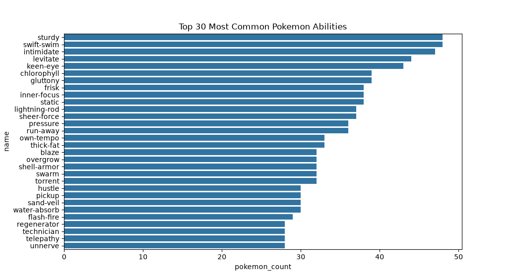
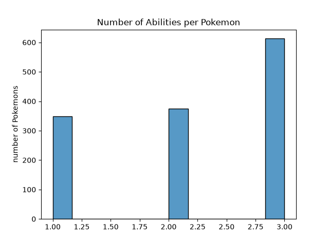

# Pokemon Data Explorer

A Python application that retrieves Pokemon data from the public **PokeAPI**, transforms it into a relational format, and stores it in a MySQL database for analysis and visualisation.

This project was created to strengthen my Python and data analysis skills by working with real-world API data, relational databases, and data processing libraries.

## Features

- Retrieves Pokemon data from the public PokeAPI
- Stores data in a MySQL database using SQLAlchemy
- Cleans and transforms API responses into a structured relational schema
- Uses Pandas for data manipulation and analysis
- Uses Matplotlib for data visualisation

## Data Source

This project uses data provided by **PokeAPI**.

https://pokeapi.co/

## Technologies

- Python
- MySQL
- SQLAlchemy
- Requests
- Pandas
- Matplotlib

## Getting Started

### Prerequisites

- Python 3.x
- MySQL
- pip

### Setup

1. Install the required Python packages.

2. Create the MySQL database schema by running the file:

```text
sqlschema/pokemon_schema.sql
```

3. Update the database connection settings in:

```text
constants.py
```

Configure your MySQL credentials:

- Host
- Port
- Database
- Username
- Password

## Available Scripts

### Data Import

#### `store_data_from_api.py`

Retrieves Pokemon data from PokeAPI, transforms the data, and stores it in the MySQL database.

Run:

```bash
python store_data_from_api.py
```

---

### Data Display

#### `display_table_data.py`

Displays the contents of database tables for quick inspection and verification.

Run:

```bash
python display_table_data.py
```

#### `display_pokemons_and_abilities.py`

Displays Pokemon together with their abilities in a paginated format for easier browsing.

Run:

```bash
python display_pokemons_and_abilities.py
```

---

### Graphing

#### `graph_top_abilities.py`

Generates a graph showing the most common Pokemon abilities stored in the database.

Run:

```bash
python graph_top_abilities.py
```

Output:
<p float="left">
  
</p>

#### `graph_abilities_per_pokemon.py`

Generates a graph showing the number of abilities for each Pokemon.

Run:

```bash
python graph_abilities_per_pokemon.py
```

Output:
<p float="left">
  
</p>

## Project Structure

```text
project/
├── models/
│   └── ability.py
│   └── base.py
│   └── pokemon.py
│   └── pokemon_ability.py
├── constants.py
├── display_pokemons_and_abilities.py
├── display_table_data.py
├── graph_top_abilities.py
├── graph_abilities_per_pokemon.py
├── screenshots/
│   └── num_of_abilities.png
│   └── top_abilities.png
├── sqlschema/
│   └── pokemon_schema.sql
├── store_data_from_api.py
└── README.md
```

## Purpose

This project was built as a practical learning exercise to develop experience with:

- Using Python
- Consuming REST APIs
- Data extraction and transformation
- Relational database design
- SQLAlchemy ORM
- Python data processing
- Data analysis with Pandas
- Data visualisation with Matplotlib

## Acknowledgements

Pokemon data provided by **PokeAPI**.

https://pokeapi.co/
